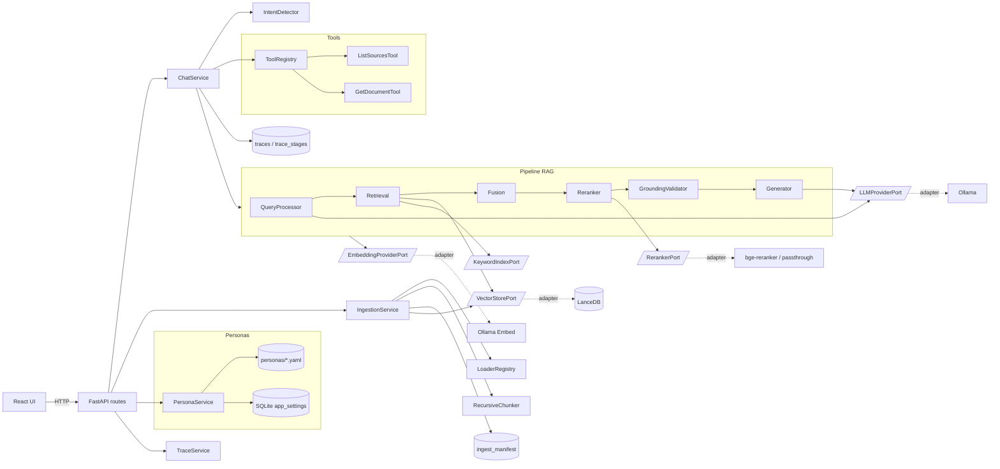

# Arquitectura de RAG-Portable

## Visión general

RAG-Portable es un asistente local con generación aumentada por recuperación, diseñado para correr **100% offline con software libre**. La arquitectura prioriza:

1. **OSS-first y local-first**: cada decisión puede ejecutarse offline. Las alternativas cloud se enchufan vía adapter, no vía rewrite.
2. **Ports & Adapters**: el dominio (chat, ingestion) habla con interfaces (`Protocol`); las implementaciones concretas son adapters intercambiables.
3. **Configurable sin redeploy**: personalidad, parámetros del pipeline y modelos cambian desde la UI, archivos YAML o variables de entorno.
4. **Observabilidad como ciudadano de primera clase**: cada etapa del pipeline mide latencia y outcome, persistido en SQLite.
5. **Compatibilidad hacia atrás**: la API pública (`/api/chat`, `/api/ingestion/run`, `/api/dashboard`) no se rompe entre fases.

## Stack tecnológico

### Frontend
- **React + Vite + Tailwind CSS** — SPA reactiva.
- **Desacople**: solo consume API REST. En producción FastAPI sirve el `dist/`.

### Backend
- **FastAPI** — capa fina de transporte y orquestación asíncrona.
- **Ollama** — motor local de inferencia (LLM `gemma3`, embeddings `nomic-embed-text`).
- **LlamaIndex** — utilidades de loaders e indexación (sólo dentro de adapters).
- **structlog** — logging estructurado por request.
- **pydantic-settings** — configuración tipada.

### Persistencia
- **LanceDB** (`data/vector_db/`) — vector store local.
- **SQLite** (`data/sql_db/app.db`) — tablas:
  - `app_settings` (persona activa y otros toggles runtime)
  - `ingest_manifest` (sha256, mtime, chunk_count por fuente)
  - `traces`, `trace_stages` (telemetría por request)

### Opcional / on-demand
- **sentence-transformers** — reranker cross-encoder local (`bge-reranker` / `MiniLM`).
- **pytesseract** — OCR local (cuando se habilite por persona/settings).

---

## Capas y responsabilidades

---

## Pipeline RAG (visión rápida)

1. **Recepción**: `ChatService.answer()` recibe la pregunta y la persona activa.
2. **Detección de intención**: si es small-talk (saludo, agradecimiento, etc.), responde con `_answer_small_talk()` sin tocar el índice.
3. **Reescritura de query** *(opcional, según persona)*: `QueryProcessor.rewrite()` o `hyde()`.
4. **Retrieval**:
   - Vectorial sobre LanceDB.
   - Keyword sobre `KeywordIndexPort` *(placeholder hoy, hookable a BM25 o LanceDB FTS)*.
   - **Vectorial y keyword corren en paralelo** con `asyncio.gather` en modo híbrido.
5. **Fusión**: Reciprocal Rank Fusion (`reciprocal_rank_fusion`).
6. **Rerank**: cross-encoder local *(si `RAG_RERANKER_ENABLED=true`)* o passthrough.
7. **Grounding gate**: si el `top_score` < `persona.grounding_threshold`, devuelve `persona.fallback_message` sin generar.
8. **Generación**: el LLM responde con `system_prompt` (compuesto desde la persona) + `user_prompt` (con contexto enumerado).
9. **Validación de citas**: marca `grounded=false` (en logs) si una cita `[archivo]` no existe en sources.
10. **Telemetría**: cada etapa registra timing en `trace_stages`.

Ver [docs/system-skeleton.md](system-skeleton.md) para diagramas de secuencia, prompts completos, contratos de cada port y comportamiento de cada servicio.

---

## Diseño modular y futuro

- **Sumar una nueva tool**: 1 archivo en `app/services/tools/` + 1 línea de registro en `container.py`. No se toca `ChatService`.
- **Cambiar de LLM**: nuevo adapter en `app/adapters/llm/` que implemente `LLMProviderPort`. Se enchufa en `container.py`.
- **Cambiar el vector store**: nuevo adapter en `app/adapters/vector_store/`.
- **Crear una persona**: archivo YAML en `app/personas/<slug>.yaml` o `POST /api/personas`. Sin reiniciar.
- **Activar reranker real**: `RAG_RERANKER_ENABLED=true` y opcionalmente `RAG_RERANKER_MODEL`.

---

## Roadmap

El roadmap completo (fases ya ejecutadas y futuras) está en `cursor/plans/` y abarca: fundación, ports & adapters, personas, calidad RAG, ingesta robusta, framework de tools y observabilidad. Los puntos UX (streaming SSE, panel de personas, debug panel) y seguridad (rate-limit, multi-workspace, auth) quedan como hooks abiertos sobre la arquitectura existente.
