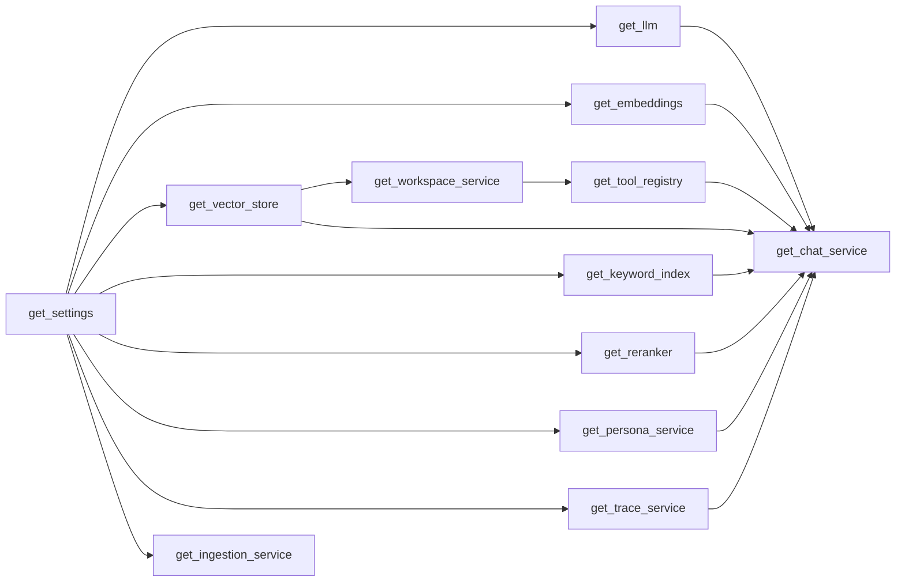
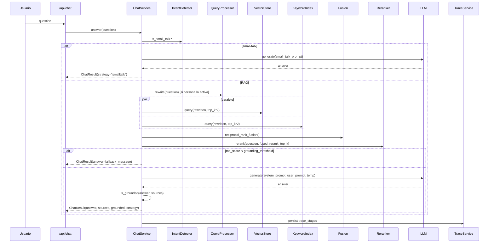

# Esqueleto del sistema — RAG Portable

Documento de referencia del **esqueleto interno** del sistema: capas, contratos, componentes, flujos y prompts. Pensado para que cualquier persona que toque el repo entienda *qué hace cada cosa* y *qué prompts viajan al LLM* en cada momento.

> Para la visión arquitectónica de alto nivel, ver [architecture.md](architecture.md).

---

## 1. Mapa del esqueleto

```text
app/
├── main.py                 # Bootstrap FastAPI: routes, middlewares, exception handlers, init SQLite
├── api/routes.py           # Capa de transporte (sin lógica de negocio)
│
├── core/
│   ├── config.py           # AppSettings (pydantic-settings) — única fuente de verdad de config
│   ├── container.py        # Inyección de dependencias (lru_cache de factories)
│   ├── db.py               # init_sqlite + sqlite_conn (context manager)
│   ├── errors.py           # AppError, OllamaError, VectorStoreError, IngestionError, RetrievalError
│   ├── logging.py          # configure_logging + request_id_middleware
│   └── prompts.py          # build_system_prompt() / build_user_prompt() / QUERY_REWRITE_PROMPT
│
├── ports/                  # Contratos (Protocol)
│   ├── llm.py              # LLMProviderPort
│   ├── embeddings.py       # EmbeddingProviderPort
│   ├── vector_store.py     # VectorStorePort
│   ├── keyword_index.py    # KeywordIndexPort
│   ├── reranker.py         # RerankerPort
│   └── tool.py             # ToolPort + ToolResult
│
├── adapters/               # Implementaciones intercambiables
│   ├── llm/ollama.py
│   ├── embeddings/ollama.py
│   ├── vector_store/lancedb.py
│   ├── reranker/passthrough.py
│   ├── reranker/cross_encoder.py
│   └── loaders/registry.py
│
├── personas/               # Personas YAML (slug, tono, parámetros, allowed_tools)
│
├── services/               # Lógica del dominio (no importa LanceDB ni urllib)
│   ├── chat.py             # ChatService — orquestador principal
│   ├── ingestion.py        # IngestionService — ingesta incremental
│   ├── chunking.py         # RecursiveChunker
│   ├── preprocessing.py    # InputNormalizer
│   ├── workspace.py        # WorkspaceService — inventario + uploads
│   ├── personas.py         # PersonaService — CRUD YAML + persona activa
│   ├── query_processor.py  # rewrite() + hyde()
│   ├── fusion.py           # reciprocal_rank_fusion()
│   ├── grounding_validator.py
│   ├── intent_detector.py  # is_small_talk()
│   ├── tool_dispatcher.py  # ToolDispatcher (loop ReAct)
│   ├── tools/registry.py   # ToolRegistry
│   ├── tools/builtin.py    # ListSourcesTool, GetDocumentTool
│   ├── tracing.py          # TraceService (timings + métricas)
│   └── models.py           # Dataclasses (RetrievedChunk, ChatResult, ...)
│
└── tools/evaluate.py       # CLI: python -m app.tools.evaluate
```

---

## 2. Configuración (`app/core/config.py`)

`AppSettings` es la **única fuente de verdad** de configuración. Carga desde `.env` (vía `pydantic-settings`) y expone paths derivados como `personas_dir`, `sqlite_db_path`, etc.

| Campo | Default | Notas |
|---|---|---|
| `ollama_base_url` | `http://localhost:11434` | |
| `chat_model` | `gemma3:latest` | |
| `embedding_model` | `nomic-embed-text:latest` | |
| `chunk_size` / `chunk_overlap` | `1200` / `180` | |
| `similarity_top_k` | `4` | Default si la persona no lo sobreescribe |
| `vector_table_name` | `document_chunks` | |
| `reranker_enabled` | `false` | Activa cross-encoder local |
| `reranker_model` | `cross-encoder/ms-marco-MiniLM-L-6-v2` | |
| `grounding_threshold` | `0.15` | La persona puede sobreescribir |
| `max_react_steps` | `3` | Iteraciones del ToolDispatcher |
| `trace_retention` | `2000` | Cantidad de traces persistidos |
| `supported_extensions` | PDF, TXT, MD, CSV, DOCX, HTML, EPUB | |

`settings.ensure_directories()` crea las carpetas necesarias en disco al arrancar.

---

## 3. Contratos (Ports)

Todas las interfaces están en `app/ports/` y usan `typing.Protocol`. El dominio (`app/services/`) **solo conoce ports**, nunca adapters.

### 3.1 `LLMProviderPort` (`ports/llm.py`)
```python
class LLMProviderPort(Protocol):
    @property
    def model(self) -> str: ...
    def health_check(self) -> bool: ...
    def generate(self, system_prompt: str, user_prompt: str, *, temperature: float = 0.1) -> str: ...
    def stream(self, system_prompt: str, user_prompt: str, *, temperature: float = 0.1) -> Iterator[str]: ...
```

### 3.2 `EmbeddingProviderPort` (`ports/embeddings.py`)
```python
class EmbeddingProviderPort(Protocol):
    def embed_query(self, text: str) -> list[float]: ...
    def embed_documents(self, texts: list[str]) -> list[list[float]]: ...
```

### 3.3 `VectorStorePort` (`ports/vector_store.py`)
```python
class VectorStorePort(Protocol):
    def is_ready(self) -> bool: ...
    def count(self) -> int: ...
    def query(self, query_text: str, top_k: int) -> list[dict]: ...
    def upsert(self, chunks: list[dict]) -> None: ...
    def delete_by_source(self, source_path: str) -> bool: ...
```

### 3.4 `KeywordIndexPort` (`ports/keyword_index.py`)
```python
class KeywordIndexPort(Protocol):
    def query(self, query_text: str, top_k: int) -> list[dict]: ...
```
Hoy hay un adapter passthrough (LanceDB FTS aún no implementado). Reemplazable por BM25 o LanceDB FTS sin tocar `ChatService`.

### 3.5 `RerankerPort` (`ports/reranker.py`)
```python
class RerankerPort(Protocol):
    def rerank(self, query: str, chunks: list[RetrievedChunk], top_k: int) -> list[RetrievedChunk]: ...
```

### 3.6 `ToolPort` (`ports/tool.py`)
```python
class ToolPort(Protocol):
    name: str
    description: str
    input_schema: dict
    def execute(self, args: dict, context: dict) -> ToolResult: ...
```

---

## 4. Adapters

Implementaciones concretas, viven en `app/adapters/`. Importan librerías externas (LanceDB, urllib, sentence-transformers, etc.). El dominio nunca las importa directamente.

| Adapter | Implementa | Notas |
|---|---|---|
| `adapters/llm/ollama.py` | `LLMProviderPort` | Reintentos exponenciales, timeout configurable |
| `adapters/embeddings/ollama.py` | `EmbeddingProviderPort` | Wrapper sobre `llama_index.embeddings.ollama` |
| `adapters/vector_store/lancedb.py::LanceDBVectorStoreAdapter` | `VectorStorePort` | Query, upsert, delete por filtro `metadata.source_path` |
| `adapters/vector_store/lancedb.py::LanceDBKeywordIndexAdapter` | `KeywordIndexPort` | Placeholder (devuelve `[]`) |
| `adapters/reranker/passthrough.py` | `RerankerPort` | Ordena por `score` y trunca a `top_k` |
| `adapters/reranker/cross_encoder.py` | `RerankerPort` | Carga lazy de `sentence-transformers` |
| `adapters/loaders/registry.py` | — | `LoaderRegistry.load_text(path)` por extensión |

---

## 5. Container (`app/core/container.py`)

Composición de dependencias mediante factories cacheadas con `lru_cache`. La API no instancia servicios directamente: usa `Depends(get_chat_service)`, etc.



`get_reranker()` decide passthrough vs cross-encoder según `settings.reranker_enabled`.

---

## 6. Personas (`app/personas/*.yaml`)

Una **persona** es la "personalidad" del asistente. Define tono, idioma, restricciones, parámetros de RAG y herramientas permitidas. Todo es runtime: cambiar persona no requiere reiniciar.

### 6.1 Schema (Pydantic, `app/services/personas.py`)

```python
class PersonaParameters(BaseModel):
    temperature: float = 0.1
    top_p: float = 0.9
    similarity_top_k: int = 4
    rerank_top_k: int = 4
    use_query_rewrite: bool = True
    use_hybrid_retrieval: bool = True
    grounding_threshold: float = 0.15
    tool_mode: str = "off"          # "off" | "auto"
    allowed_tools: list[str] = []

class Persona(BaseModel):
    slug: str
    name: str
    language: str = "es-AR"
    tone: str = "profesional y conciso"
    domain: str = "general"
    constraints: list[str] = []
    parameters: PersonaParameters = ...
    few_shot: list[dict[str, str]] = []
    fallback_message: str = "No tengo suficiente información en los documentos proporcionados para responder a esto."
```

> Nota técnica: en YAML, `tool_mode: off` es booleano. Por eso se escribe `"off"` con comillas y, además, hay un `field_validator` que normaliza booleanos a `"off" / "auto"` defensivamente.

### 6.2 Personas seed

| Slug | Tono | Temperatura | Tool mode | Uso típico |
|---|---|---|---|---|
| `default` | profesional pero cercano, claro y conversacional | `0.35` | `off` | Default general |
| `enterprise-analyst` | analítico, formal y directo | `0.3` | `auto` | Reportes financieros y operativos |
| `developer-helper` | técnico, pragmático y claro | `0.35` | `auto` | Ingeniería de software |
| `friendly-tutor` | cercano, pedagógico y claro | `0.25` | `off` | Aprendizaje |

### 6.3 API

| Método | Endpoint | Acción |
|---|---|---|
| `GET` | `/api/personas` | Lista personas disponibles |
| `GET` | `/api/personas/active` | Persona activa actual |
| `POST` | `/api/personas/active` | Cambia la persona activa (`{ slug }`) |
| `POST` | `/api/personas` | Upsert de persona (valida con Pydantic + persiste YAML) |

La persona activa se persiste en `app_settings(key='active_persona')`.

---

## 7. Prompts del sistema

Todos los prompts viven en `app/core/prompts.py` y se construyen dinámicamente desde la persona activa.

### 7.1 `build_system_prompt(persona, tool_schemas=None)`

Compone el system prompt para la rama RAG. **Reglas duras** preservadas: solo afirmar lo respaldado por contexto y respetar `fallback_message` exacto.

```text
Eres {persona.name}, un asistente local especializado en {persona.domain}.
Idioma preferido: {persona.language}.
Tono: {persona.tone}.

Cómo respondes:
- Hablas de forma natural y fluida, como una persona experta explicándole a un colega.
- Usas párrafos cortos y conectores naturales en lugar de enumerar viñetas mecánicamente.
- Comienzas con una respuesta directa a la pregunta y luego desarrollas lo necesario.
- Reformulas el contenido de las fuentes con tus palabras; no copies frases textuales.
- Integras las citas en la prosa con el formato [Nombre del Archivo] solo cuando aporten evidencia clave; evita citar cada oración.

Reglas obligatorias:
- Solo afirmas lo que está respaldado por el contexto provisto. No inventas datos ni recurres a conocimiento externo.
- Si la evidencia es insuficiente para responder con seguridad, contestás exactamente: "{persona.fallback_message}"
{constraints}        ← cada item de persona.constraints como "- {item}"
{tools_block}        ← presente sólo si tool_schemas != None
```

Cuando `tool_schemas` viene con tools (modo `auto`), se appende:

```text
Herramientas disponibles (JSON schema):
[{...}, {...}]
Si necesitas usar herramienta, responde estrictamente con JSON: {"tool_call": {"name": "...", "args": {...}}}
Si no necesitas herramientas, responde estrictamente con JSON: {"answer": "..."}
```

### 7.2 `build_user_prompt(question, context_blocks)`

Compone el user prompt en la rama RAG. Cada bloque tiene formato `[Fuente N] {source_path}\n{texto}`.

```text
Contexto recuperado de los documentos del usuario:
{joined_context}

Pregunta del usuario:
{question}

Cómo redactar la respuesta:
- Apóyate exclusivamente en el contexto de arriba.
- Sé conversacional y claro, evita sonar mecánico o como una lista de bullets crudos.
- Cita el archivo [Nombre del Archivo] cuando una afirmación lo necesite, integrándolo en la oración.
- Si falta evidencia para alguna parte de la pregunta, indícalo con naturalidad.
```

### 7.3 `QUERY_REWRITE_PROMPT`

Usado por `QueryProcessor.rewrite()` antes del retrieval, cuando `persona.parameters.use_query_rewrite=true`.

```text
Eres un experto en optimización de motores de búsqueda semántica.
Tu tarea es reescribir la consulta del usuario para maximizar las posibilidades de encontrar información relevante en una base de datos vectorial.

Reglas:
1. Extrae la intención principal de la consulta.
2. Añade sinónimos relevantes y jerga de dominio si es aplicable.
3. Elimina palabras vacías (stopwords) o saludos.
4. Devuelve SOLO la consulta reescrita, sin introducciones ni explicaciones.

Consulta original: {question}
Consulta optimizada:
```

### 7.4 Prompt de small-talk (inline en `ChatService._answer_small_talk`)

Cuando `is_small_talk(question) == True`, se salta retrieval/rerank/grounding y el LLM responde con este system prompt:

```text
Eres {persona.name}. Tono: {persona.tone}. Idioma: {persona.language}.
Responde de forma breve, natural y cordial. No cites fuentes ni inventes datos.
Si el usuario pregunta cosas factuales, sugiere que pueden indagarlo en sus documentos.
```

User prompt: la pregunta tal cual (`question`).

### 7.5 Prompt de HyDE (inline en `QueryProcessor.hyde`)

Estrategia alternativa al rewrite (la persona puede elegirla en el futuro vía `query_strategy`).

```text
Escribe un párrafo hipotético que responda la pregunta para mejorar retrieval.
```

User prompt: pregunta original.

---

## 8. Servicios principales

### 8.1 `ChatService` (`services/chat.py`)

Orquestador del flujo de chat. Construido con todos los ports + `PersonaService` + `TraceService` + `ToolRegistry`.

**Algoritmo de `answer(question)`**:



**Cosas a destacar**:
- `vector_retrieve` y `keyword_retrieve` se ejecutan **en paralelo** con `asyncio.gather` cuando la persona habilita retrieval híbrido.
- `_collect_sources` se calcula una sola vez por respuesta.
- Cada etapa (`query_rewrite`, `vector_retrieve`, `keyword_retrieve`, `fusion`, `rerank`, `generate`, `generate_smalltalk`) registra timing en `TraceService`.
- Logs estructurados con eventos: `chat.request.received`, `chat.smalltalk.detected`, `chat.query_rewrite.done`, `chat.retrieval.done`, `chat.rerank.done`, `chat.grounding.below_threshold`, `chat.grounding.invalid_citation`, `chat.generate.done`, `chat.request.completed`.

### 8.2 `IngestionService` (`services/ingestion.py`)

Ingesta **incremental** basada en manifest SQLite (`ingest_manifest`).

**Flujo**:
1. `ensure_directories()`.
2. Descubre archivos en `data/raw/` con extensión soportada.
3. Para cada archivo, calcula `sha256 + mtime` y lo compara con el manifest.
4. Si cambió (o `rebuild_index=true`), borra sus chunks de LanceDB (`delete_by_source`) y reindexa.
5. Construye chunks con `RecursiveChunker` aplicando dedup por `sha256` del texto del chunk.
6. Inserta vía `vector_store.upsert([{chunk_id, text, metadata}])`.
7. Actualiza `ingest_manifest`.

Loaders: `LoaderRegistry.load_text(path)` resuelve por extensión usando `SimpleDirectoryReader` con fallback a lectura cruda.

### 8.3 `WorkspaceService` (`services/workspace.py`)

- `list_sources()` cruza inventario en disco con conteos del vector store (`source_chunk_counts()` del adapter).
- `save_uploaded_files(files)` valida extensión y guarda en `data/raw/`.
- `delete_source(source_path)` borra archivo + chunks (`vector_store.delete_by_source`).

### 8.4 `PersonaService` (`services/personas.py`)

- `list_personas()` lee todos los `*.yaml` de `app/personas/`.
- `get_active()` resuelve la persona activa desde `app_settings`.
- `set_active(slug)` persiste el slug.
- `upsert(payload)` valida con Pydantic y escribe el YAML.

### 8.5 `QueryProcessor` (`services/query_processor.py`)

- `rewrite(query)` aplica `QUERY_REWRITE_PROMPT` y limpia comillas/saltos al final.
- `hyde(query)` genera un párrafo hipotético para retrieval (estrategia alternativa, hookable).

### 8.6 `IntentDetector` (`services/intent_detector.py`)

`is_small_talk(question)` con patrones regex para saludos, agradecimientos, despedidas y preguntas de presentación. Solo matchea si el largo es ≤ 80 chars.

### 8.7 `ToolRegistry` + `ToolDispatcher`

- `ToolRegistry.register(tool)` agrega herramientas al runtime.
- `ToolRegistry.schema_for_llm()` arma el listado de descriptores que se inyecta en el system prompt cuando la persona usa `tool_mode: "auto"`.
- `ToolDispatcher.run(system, user, ctx)`: loop ReAct mínimo (default 3 iteraciones). Parsea JSON con regex tolerante. Si el LLM devuelve `{"tool_call": ...}`, ejecuta la tool y reinjecta el `ToolResult` en el siguiente turno.

**Tools built-in** (`services/tools/builtin.py`):
- `list_sources` — lista fuentes disponibles.
- `get_document` — devuelve los primeros 5000 chars del documento por `source_path`.

### 8.8 `TraceService` (`services/tracing.py`)

- `with traces.stage(request_id, persona_slug, stage):` context manager que mide y persiste duración + outcome.
- Rotación automática (`trace_retention`).
- `latest(limit)` y `metrics()` para consumo desde `/api/traces` y `/api/metrics`.

### 8.9 `GroundingValidator` (`services/grounding_validator.py`)

`is_grounded(answer, source_names)` chequea que cada cita `[archivo]` en el `answer` exista en `sources`. Si no, marca `grounded=false` (visible solo en logs, no en UI).

---

## 9. Endpoints (`app/api/routes.py`)

Capa fina, sin lógica de negocio. Todos los handlers usan `Depends(...)` para inyección.

| Método | Endpoint | Servicio |
|---|---|---|
| GET | `/api/health` | `ChatService.health_check()` |
| GET | `/api/dashboard` | health + sources + studio_cards |
| GET | `/api/sources` | `WorkspaceService.list_sources()` |
| POST | `/api/sources/upload` | `WorkspaceService.save_uploaded_files()` |
| POST | `/api/sources/delete` | `WorkspaceService.delete_source()` |
| POST | `/api/ingestion/run` | `IngestionService.ingest()` |
| POST | `/api/chat` | `ChatService.answer()` |
| GET | `/api/personas` | `PersonaService.list_personas()` |
| GET | `/api/personas/active` | `PersonaService.get_active()` |
| POST | `/api/personas/active` | `PersonaService.set_active(slug)` |
| POST | `/api/personas` | `PersonaService.upsert(payload)` |
| GET | `/api/traces` | `TraceService.latest(limit)` |
| GET | `/api/metrics` | `TraceService.metrics()` |

---

## 10. Persistencia (SQLite)

Inicialización en `app/core/db.py::init_sqlite(settings)`.

```sql
CREATE TABLE app_settings (
  key TEXT PRIMARY KEY,
  value TEXT NOT NULL,
  updated_at TEXT NOT NULL DEFAULT CURRENT_TIMESTAMP
);

CREATE TABLE ingest_manifest (
  source_path TEXT PRIMARY KEY,
  sha256 TEXT NOT NULL,
  size INTEGER NOT NULL,
  mtime REAL NOT NULL,
  last_indexed_at TEXT NOT NULL DEFAULT CURRENT_TIMESTAMP,
  chunk_count INTEGER NOT NULL
);

CREATE TABLE traces (
  request_id TEXT PRIMARY KEY,
  persona_slug TEXT NOT NULL,
  created_at TEXT NOT NULL DEFAULT CURRENT_TIMESTAMP
);

CREATE TABLE trace_stages (
  id INTEGER PRIMARY KEY AUTOINCREMENT,
  request_id TEXT NOT NULL,
  stage TEXT NOT NULL,
  duration_ms REAL NOT NULL,
  ok INTEGER NOT NULL,
  detail TEXT,
  created_at TEXT NOT NULL DEFAULT CURRENT_TIMESTAMP
);
```

---

## 11. Observabilidad

### Logs (structlog)
Cada request inyecta `request_id` vía `request_id_middleware`. `ChatService` agrega `persona` y `question` al contexto. Eventos clave:

- `chat.request.received`
- `chat.smalltalk.detected` / `chat.smalltalk.done`
- `chat.query_rewrite.done` (incluye `optimized_query`)
- `chat.retrieval.done` (`strategy`, `vector_hits`, `total_hits`, `duration_ms`)
- `chat.rerank.done` (`kept`, `top_score`, `duration_ms`)
- `chat.grounding.below_threshold` *(warning)*
- `chat.grounding.invalid_citation` *(warning)*
- `chat.generate.done` (`duration_ms`, `model`)
- `chat.request.completed` (`total_duration_ms`, `strategy`, `grounded`)

### Trazas y métricas
`/api/traces?limit=N` devuelve las últimas N etapas. `/api/metrics` devuelve `count`, `p50_ms`, `p95_ms` agregados.

---

## 12. Front (resumen)

UI React en `frontend/src/`. Tres paneles principales:
- **SourcesPanel** — gestión de fuentes (upload, delete, refresh).
- **ChatPanel** — chat con render de mensajes + pills de fuentes citadas.
- **StudioPanel** — tarjetas de estado (Ollama, modelo, vector store, Top K, etc.).

Decisiones de UX:
- El banner de feedback se auto-cierra a los ~4.2 s.
- Los chips internos `Grounded / Baja evidencia / Retrieval: X` quedaron **solo en logs**, fuera del front (ruido innecesario para el usuario final).
- Acepta uploads de PDF, TXT, MD, CSV, DOCX, HTML y EPUB.

---

## 13. Cómo extender el sistema

| Quiero... | Dónde toco |
|---|---|
| Cambiar el LLM | nuevo adapter en `app/adapters/llm/` + factory en `container.py` |
| Cambiar el vector store | nuevo adapter en `app/adapters/vector_store/` |
| Activar reranker real | `RAG_RERANKER_ENABLED=true` en `.env` |
| Agregar una persona | crear `app/personas/<slug>.yaml` o `POST /api/personas` |
| Agregar una tool | nuevo archivo en `app/services/tools/` + registro en `container.py::get_tool_registry` |
| Agregar un loader | extender `LoaderRegistry.load_text` |
| Cambiar el prompt | editar `app/core/prompts.py` |
| Agregar una métrica | nueva etapa con `traces.stage(...)` en `ChatService` |

---

## 14. Notas finales

- Toda la pieza es **OSS-first y local-first**. Las dependencias opcionales (sentence-transformers, pytesseract) se activan por flag y no son requeridas para correr el flujo base.
- La regla más importante del proyecto: **el dominio nunca importa adapters ni librerías de transporte**. Si una nueva feature obliga a romper esto, primero se crea un port.
